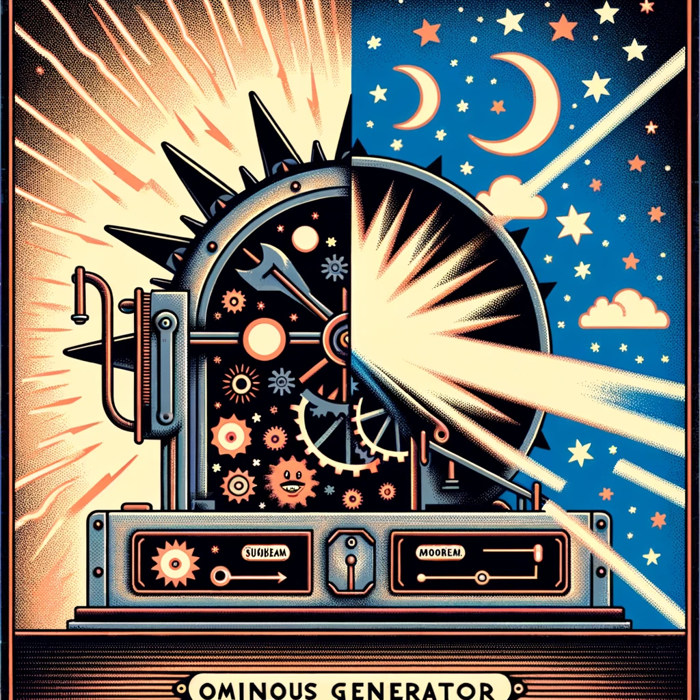

# Ominous Generator: A Vue.js App into the Realm of Sinister Positivity and Dark Negativity

<div></div>

Welcome to the Ominous Generator, a Vue.js powered web app where the sun shines a little too bright, and the night whispers a tad too loudly. This is not your ordinary motivational quote generator. Instead, we get into the world of 'Ominous Positivity' and 'Dark Negativity,' where every sentence is a roller coaster ride of emotions, filled with twists and turns that leave you delightfully perplexed.

## Project Overview

The Ominous Generator is a quirky, interactive web application developed using Vue.js, showcasing a unique blend of inspiring and daunting messages. This project is a fun exploration into the world of web development, combining humor, creativity, and a dash of existential dread (the good kind, we promise!).

### What's Inside the Box?

- **Two Flavors of Fortune**: Choose your destiny with two distinct generators - one that serves you a cocktail of aggressive optimism, and another that dishes out doses of ominous foreboding.
- **Interactive UI**: Engage with big, bold buttons labeled 'Positivity' (sun-kissed, of course) and 'Negativity' (moonlit, naturally), and watch as the generator conjures up phrases that are equal parts motivating and menacing.
- **Responsive Design**: Tailored to fit every screen size. Whether you're on a desktop conjuring up some positive vibes, or on your phone in a dark alley looking for a foreboding omen, we've got you covered.
- **Vue.js & Pinia at Heart**: Built using Vue.js and harnessing the power of Pinia for state management, this app is a testament to the fun and flexibility of modern web development.

## How to Use the Ominous Generator

1. **Choose Your Fate**: Click on 'Positivity' for an aggressively optimistic message, or 'Negativity' for a darkly negative one.
2. **Behold the Outcome**: Watch as the app generates a unique, two-part sentence - starting with a promise or warning, and ending with an inevitable twist.
3. **History of Your Fortunes**: The app keeps track of your generated sentences, displaying the most recent ones in a list for your amusement (or existential contemplation).

## Contribute & Collaborate

Got an idea to make the Ominous Generator even more whimsically sinister? We love collaboration! Feel free to fork the repo, push some changes, or reach out with your ideas. Let's make the web a more amusing place, one ominous message at a time!

---

Embrace the fun, the strange, and the slightly ominous. Happy generating!

*Remember: Every day is a good day, some are just a bit more... ominous.* 🌙☀️🖤💛

---

## Recommended IDE Setup

[VSCode](https://code.visualstudio.com/) + [Volar](https://marketplace.visualstudio.com/items?itemName=Vue.volar) (and disable Vetur) + [TypeScript Vue Plugin (Volar)](https://marketplace.visualstudio.com/items?itemName=Vue.vscode-typescript-vue-plugin).

## Project Setup

```sh
pnpm install
```

Compile and Hot-Reload for Development
```sh
pnpm dev
```

Type-Check, Compile and Minify for Production
```sh
pnpm build
```

Run Unit Tests with [Vitest](https://vitest.dev/)
```sh
pnpm test:unit
```

Run End-to-End Tests with [Playwright](https://playwright.dev)
```sh
# Install browsers for the first run
npx playwright install

# When testing on CI, must build the project first
pnpm build

# Runs the end-to-end tests
pnpm test:e2e
# Runs the tests only on Chromium
pnpm test:e2e --project=chromium
# Runs the tests of a specific file
pnpm test:e2e tests/example.spec.ts
# Runs the tests in debug mode
pnpm test:e2e --debug
```

Lint with [ESLint](https://eslint.org/)
```sh
pnpm lint
```
